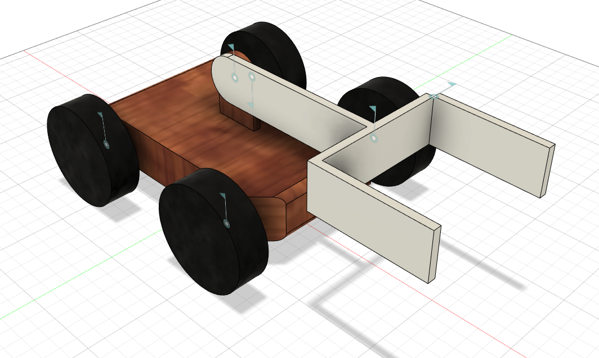
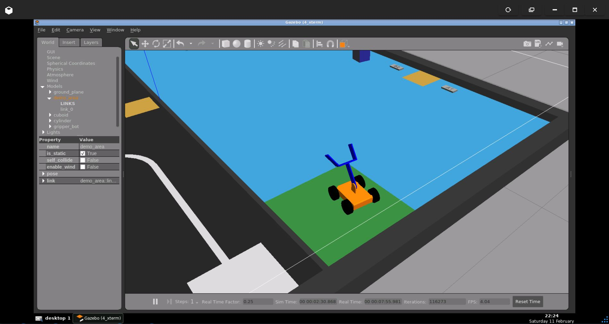
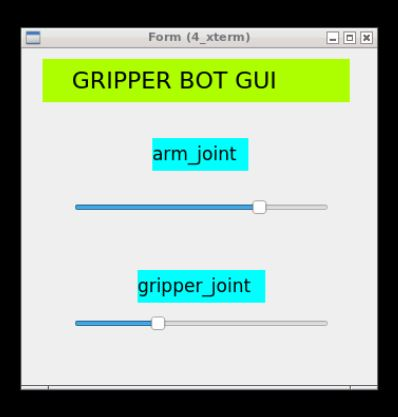

# GRIPPER BOT
## Robot Simulation with Gripper and GUI. 
<br>

&nbsp;

___________________________________________________________________________

# **Details About Project**

## Software Used
- Fusion360 -> For designing the 3D Model of the robot.
- [fusion2urdf](https://github.com/syuntoku14/fusion2urdf) -> Fusion360 script to export urdf from fusion 360 directly. 
- ROS (Robot Operating System) 
- Gazebo 
- Rviz 
- [QT Designer](https://doc.qt.io/qt-5/qtdesigner-manual.html) -> For GUI

Robot Drive Plugin Used - [Skid Steering Drive - Gazebo](http://gazebosim.org/tutorials?tut=ros_gzplugins#SkidSteeringDrive)

## Fusion360 Model
<div align="center">

<br />
</div>

<!-- ## Final Rendered Fusion360 Model
<div align="center">

<br />
</div>

## Gazebo Simulation
<div align="center">

<br />
</div> -->

<!-- ## GUI 
To control **Arm** and **Gripper** of robot. <br/>
**GUI** Designed using **QT Designer** software.
<div align="center">

<br />
</div> -->

## Clone this repository inside your ROS Workspace:
```
cd ~/catkin_ws/src/
git clone https://github.com/nilutpolkashyap/gripper_bot.git
cd ~/catkin_ws/
catkin_make
source devel/setup.bash
```

## Launch the simulation
Type the command in a terminal to launch the Gripper Bot world simulation:
```
roslaunch gripper_bot_description spawn.launch
```
<div align="center">
</div><br />

Type the command in another terminal to run the GUI:
```
cd ~/catkin_ws/src/gripper_bot/gripper_bot_description/src
python3 gui.py
```
<div align="center">
</div>

## Output
<div align="center">

<br />
</div>

## RQT Graph Output
<div align="center">

<br />
</div>
